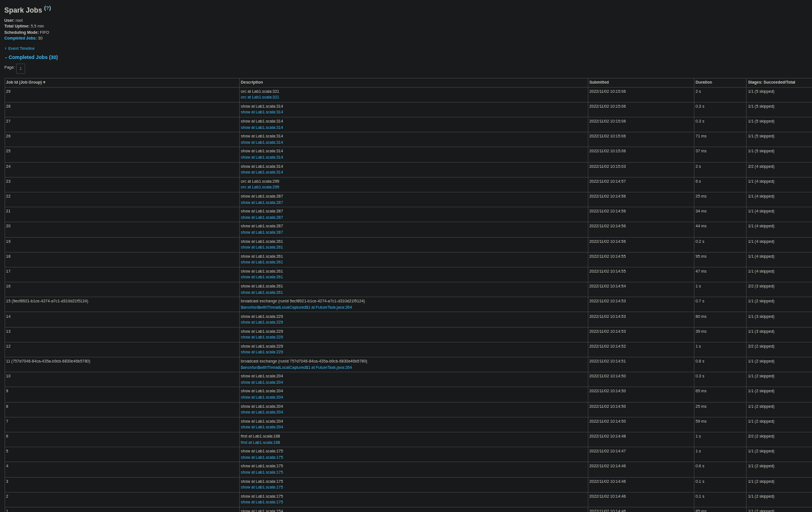
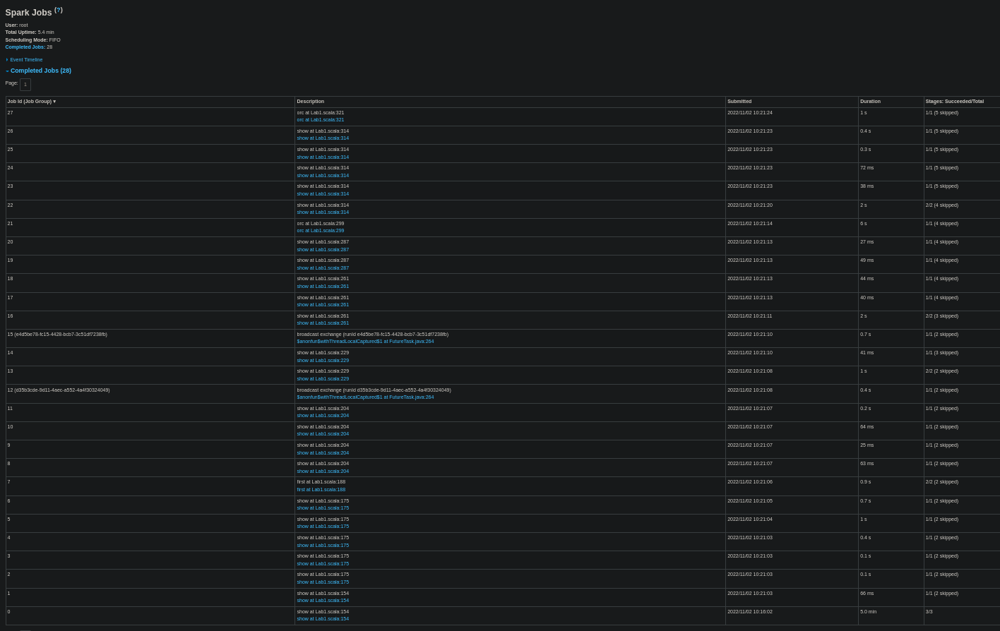
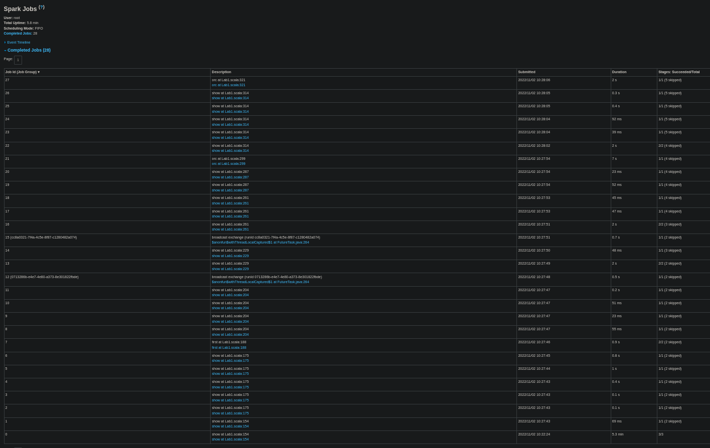

# Lab 1 Report

## Usage

Compile scala by opening sbt shell with root access on root dir and type `~run`. This can sometimes output a false error, ignore that. Run `./run.sh 12` from root of repository to run the assignment with sealevel of 12. Orc files will be placed in `output/`.

If you do not enter an integer, the program will exit with flag 1 and tell you to enter an integer. Decimal numbers will not be accepted, even though 42.0 is same as 42. Entering integers beyond the bound of int will be rejected. Negative integers will be treated as a fall in sealevel and is considered valid input.

## Functional overview

We read the data, perform some data exploration, do adequate, good and excellent requirements and finally write out the outputs.

### Step 1: Preparing Data and Input

By defining a schema and a case class where we type-cast every attribute, it allows us to be type-safe, forcing the datasets to have the correct data types in their columns.

In order to load the Orc file into a DataSet, so we can use compile-time type checking, while allowing
Spark to optimize queries and storage, we created a case class containing the following fields:

<p align="center">

</p>
<h6 align="center"> Figure 1: Type Casting Orc Files </h6>


The same applies to the parquet files, where the following case class was used:

<p align="center">

</p>
<h6 align="center"> Figure 2: Type Casting Parquet Files </h6>


### Step 2: Data Exploration

Right after reading the Orc file, we apply some filters. First if the doesn't have latitude and longitude values, they
will be discarded (we found at least one harbour without these values). After we will filter the rows we are interested
in, which will be one of two type:

* If it's a harbour
* If it's a city/town/village/hamlet with non-null population

This information is stored in dataSetCities dataset. This dataset contains the following columns:
* **place: String** name of the place
* **num_evacuees: Int** population in that place
* **city_type: Boolean** True if it's a city, False if anything else (town/village/hamlet). This will make it faster to filter out just cities further down the line when we need to search for safe destinations
* **h3index: String** Contains h3 index of the corresponding hexagon
* **lat: Double** latitude
* **lon: Double** longitude
* **harbour: Boolean** True if it's a harbour, False otherwise.

### Step 3: Adequate Requirements
There are two sources of data at this moment, `dataSetCities` has latitude, longitude, name of place and some other fields, but does not have elevation. `dataSetElevation` has elevations but does not have latitude and longitude. We group each point from the parquet dataset through their spatial index from H3 and calculate the average elevation at the same time. This allows us to reduce the size of this dataset according to the resolution 9 (bigger resolution = more indexes = more rows).

A serializable udf that returns H3 index given latitude and longitude was made to add h3index to `dataSetCities`. A left inner join on h3index is performed on `dataSetCities` to `dataSetElevation` so that the resulting dataset, `dataSetAdequate` connects latitude and longitude with elevation of locations.

The last step is straightforward, filter on places that are below sealevel and write it to an orc file. Also add their populations. This is done efficiently using a cache after filter.

### Step 4: Good Requirements
`dataSetAdequate` is divided into 3, `safeCities` (cities above sealevel), `unsafePlaces` (cities, towns, hamlets, villages <= sealevel) and `harbours` and cache these because they will be used later. Unsafe places are those where the entire population needs to be evacuated so we also calculate total number of evacuees at that sealevel rise as required in the assignment by using an aggregation here.

The last step is to make `goodDataSet` by matching unsafe places to their nearest safe cities by calculating distance of each unsafe place to a safe city and selecting minimum. We use a join with a distance udf, rank the distances and pick the smallest. Once again unpersist unrequired data and cache `goodDataSet`.

### Step 5 Excellent Requirements
The code of this step is similar to that of the previous step. We already have the closest safeCity name and distance for each unsafe place. Do the same steps as before and acquire the distance to the closest harbour. If harbour is closer than the closest safe city for an unsafe place, we mark it as such in `dataSetFinalJoin`.

Finish this step by making new columns to match the required the output in orc files and fill them by sending a quarter of evacuees to Waterworld where possible (these places have already been marked earlier so it's straightforward to multiply num_evacuees with 0.25 and 0.75). We cast these to integer to avoid decimals which means we always round down so the total number of evacuees after adding from orc files will be slightly smaller than the number we calculated in the previous step. To confirm, the difference in num_evacuees from the two calculations must always be lesser than the number of unsafe places because we always round down.

### Step 6: Write output
Here we write all our orc files and perform aggregations required. `dataSetFinalJoin` is in cache and used to make other datasets, `harbouredEvacuees` for the calculations required to figure out how evacuees going to live in Waterworld. `dataSetExcellent` is then made to combine the evacuees going to a harbour and those not going to harbour with a union and write it.

The files can be found in `/output` with names `excellent.orc` and `excellent1.orc` respectively.

### Code Abstractions
We don't really know what code can be abstracted, the limited abstractions we could make are at the bottom of the scala file.

## Result

Our code will print a lot of tables so we are attaching the relevant output below. The third print statement will look like [Figure 3](#needToMove), the first orc file looks like [Figure 4](#orc1) and the second orc file like [Figure 5](#orc2).

<div id="needToMove"></div>
<p align="center">

</p>
<h6 align="center"> Figure 3: Population that needs to move for sealevel rise of 100m </h6>

<div id="orc1"></div>
<p align="center">

</p>
<h6 align="center"> Figure 4: 1<sup>st</sup> orc file for sealevel 12 </h6>

<div id="orc2"></div>
<p align="center">

</p>
<h6 align="center"> Figure 5: 2<sup>nd</sup> orc file for sealevel 12m </h6>

```
At sealevel rise of   0 m,  1,104,600 need to evacuate. Calculated in 5.5 minutes. 
At sealevel rise of  10 m,  9,212,549 need to evacuate. Calculated in 5.9 minutes. 
At sealevel rise of  12 m, 10,560,344 need to evacuate. Calculated in 5.4 minutes. 
At sealevel rise of 100 m, 17,019,227 need to evacuate. Calculated in 5.8 minutes.
```
See [logs](#logs) for pictures of the history server. These benchmarks are not consistent because when we re-run them, we get slightly different results such as 12m sealevel rise sometimes needing over 6m. We suspect this is because of CPU throttling. In lab 2, we made more optimisations and we brought the time down even further.

## Scalability

Our code is fairly scalable in both ram because of efficient caching and in cpu because we made efforts to
write optimal code. Some examples are
- drop columns that are not needed to save RAM (lines: 152, 220, 249)
- always select columns that are used later (used in almost every pipeline, often at the end after computing and also at the start when joining)
- move filters up to only keep relevant rows (lines: 94, 98, 306)
- in schema, many parameters are set `nullable = false` for instance we have no use for rows where latitude is null.
- type-cast appropriately so that Scala does not have to infer and this allows using primitive type comparisions which are faster (lines: 112, 113, 114) and used at lines 179, 189
- we used collect to find the closest safe cities initially but that does not scale well, so we changed to UDF and don
't use collect anywhere anymore
- we have 2 UDF functions, for h3 index and calculating distances
- we cache and unpersist dataSets very carefully so that scala always computes everything exactly once (optimal)
- we tried to minimize re-shuffling of data in join by dropping columns and adding them back later. Our thought was that in a join, the primary keys of the dataset are joined and other columns are redundant. They are shuffled and slowdown IO so if we drop these columns and them later, we can make our joins faster. On the netherlands dataset, we observed the opposite infact with the time taken almost doubling from 6 minutes to 11 minutes by doing this for just the first join (parquet and orc files).

Joins are very expensive operations, and do not scale very well with bigger datasets. In an attempt to optimize the joins, we tried to split [one big join operation into smaller join operations](https://medium.com/analytics-vidhya/4-performance-improving-techniques-to-make-spark-joins-10x-faster-2ec8859138b4). This idea came after looking at an example where they optimized a join by doing smaller join operations in which they grouped parts of the dataset based on timestamps. Unfortunately, we could not implement this in a way where we could see meaningful improvement in performance.

## Performance

Total time 5.4 minutes for complete netherlands dataset with sealevel rise of 12. The data below is taken from [Figure 8](#12).

5 minutes were required to read the files and perform the first join of parquet and orc file. We did not cache after reading because those val are used only once and hence scala is lazy so it does the reading and joining at the same step and history-server is unable to tell us the time put in reading and joining.
All steps after this were in milliseconds (discussed later) or seconds. We attribute this to the many small optimizations we made everywhere we could think of. We did find some of them surprisingly fast and list them below.
- the `join` on line 212 needed only 1 second. This join finds the closest city for all unsafe places.
- the `join` on line 243 needed about 2 seconds. This join finds the closest harbour. We think this takes lesser time because there are fewer harbours than safeCities.
- `union` on line 283 needed 49 ms which is impressive, we think this is because of small datasets and low level optimizations by spark.
- writing the first `orc` file on line 299 took 2s but this step is known to sometimes take upto 7s which is quite suprising because the joins before this took a combined 5.5 seconds and the size of file written is 301.3 kB. We have no explanation here, this is probably IO. One factor that can play a role is that our `write` overwrites existing files with the same name and removing the old file may take some time but posix is supposed to do this very quickly.
- writing the other `orc` file on line 231 took 1 seconds for writing 1.3 kB. This has previously taken upto 2s and the same arguments as the previous one for writing apply here.
- the other operations are a combination of basic spark functions like `select`, `filter` and `withColumn` which are of linear complexity and `withColumnRenamed` is constant complexity.

Our bottleneck is the first join which is mostly IO tasks of reading data from files and shuffling data for join. This join is quite large, even after drastically reducing size of orc file by discarding rows we don't need very early. We were unable to filter the parquet file in a similar way to a smaller size. This then effectively has a complexity of O(#orc * #parquet) + complexity of IO. We were not able to force scala to compute at specific points in a nice way so we used print statement `show` so that scala is forced to compute and cache. 

Print statements are expensive because they are also IO, even though we can not observe anything significant in the history server. Since scala computes when seeing a print statement, we notice that constructing DAGs only requires milliseconds but executing the DAGs sometimes needs seconds which makes sense and gives confidence that we are doing it correct.

We also use the h3 tool to assign each point in the Parquet dataset a spatial index. By using spatial indexes, we reduce the complexity of the join of Orc and Parquet files. A left merge join complexity is given by O(N*Log(N) + M*Log(M)), by reducing the size of M, the computation complexity of the join is reduced aswell.

<div id="logs"></div>

## Spark History Server Logs

<p align="center">

</p>
<h6 align="center"> Figure 6: Sealevel rise 0m </h6>

<p align="center">

</p>
<h6 align="center"> Figure 7: Sealevel rise 10m </h6>

<div id="12"></div>
<p align="center">

</p>
<h6 align="center"> Figure 8: Sealevel rise 12m </h6>

<p align="center">

</p>
<h6 align="center"> Figure 9: Sealevel rise 100m </h6>
